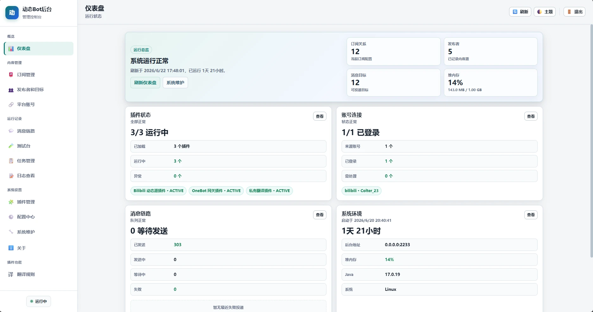
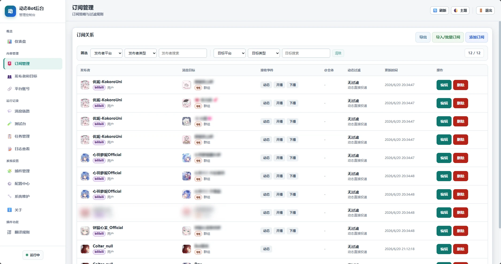
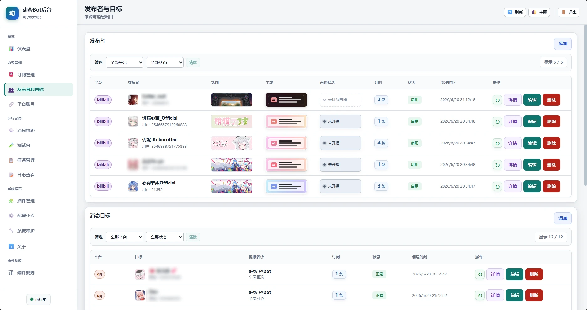
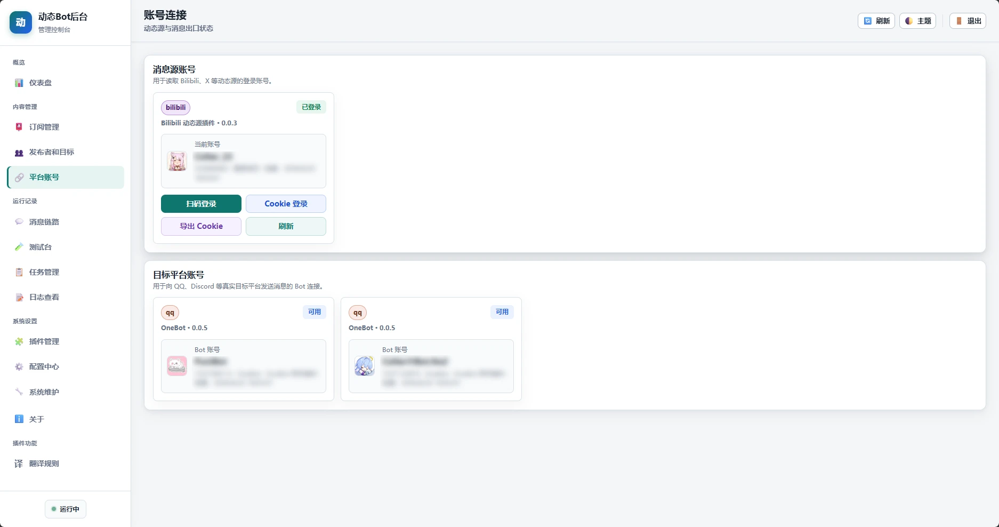
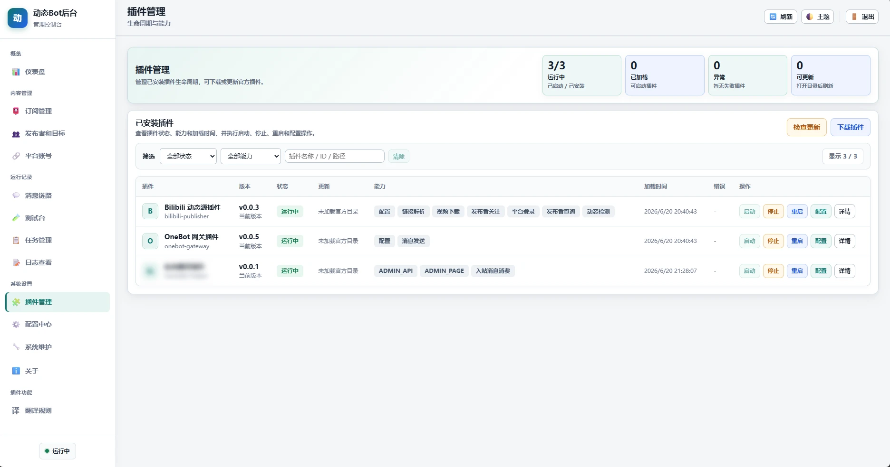
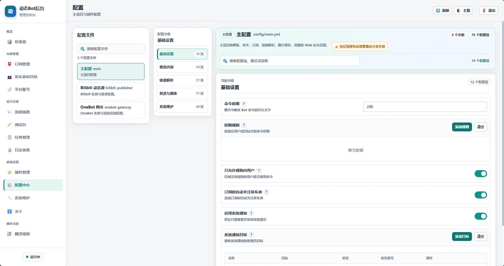
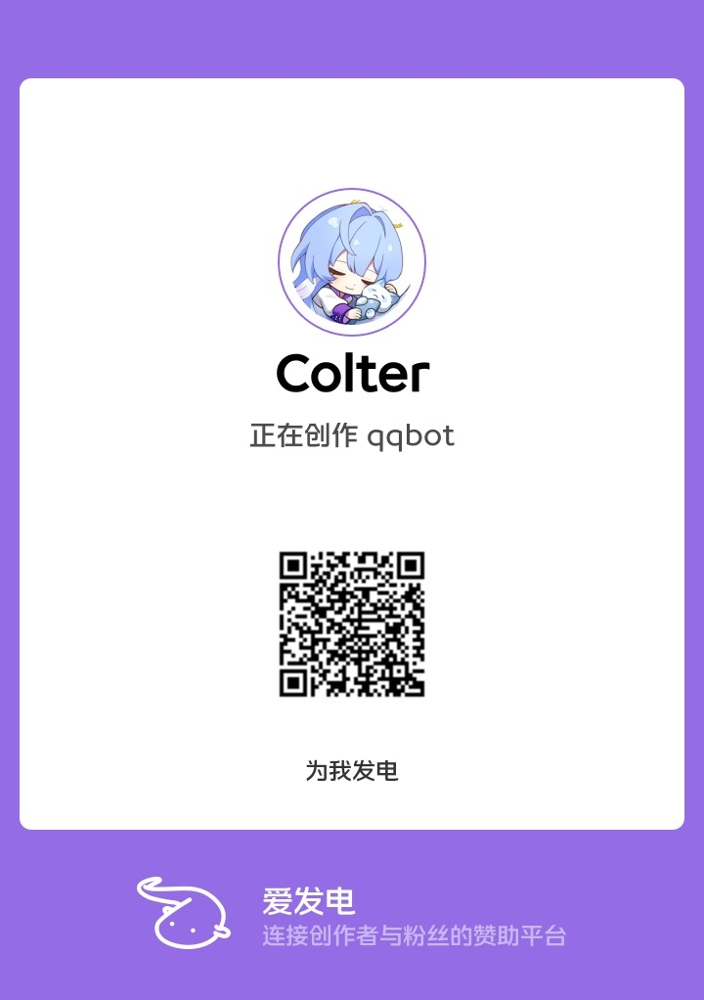

# dynamic-bot

<p align="center">
  
</p>

<p align="center">
  <a href="https://github.com/Colter23/dynamic-bot/actions/workflows/ci.yml"></a>
  <a href="https://github.com/Colter23/dynamic-bot/releases"></a>
  <a href="LICENSE"></a>
  
  
  
</p>

dynamic-bot 是面向动态订阅、直播提醒、链接解析和动态绘图推送的可扩展 Bot 主程序。它提供 Web 后台、插件运行时、统一消息链路和高质量推送图片渲染。

主程序保持平台无关，Bilibili、微博、QQ 等接入由官方插件提供。

QQ群：734922374

## 特性

- 动态绘图：把动态、直播、链接解析结果渲染成适合聊天窗口阅读的图片卡片。
- 订阅转发：支持动态推送、直播提醒、链接解析、测试预览和多平台消息出口。
- Web 后台：集中管理发布者、消息目标、订阅、插件、配置、日志、任务和消息记录。
- 统一消息链路：入站识别命令和链接，出站记录投递、回执、重试、撤回和审计状态。
- 多 Bot 路由：支持同一平台多个 Bot 账号按目标和策略选择发送账号。
- 插件化扩展：内容来源、消息出口、命令和后台页面都可以由插件提供。

## 项目预览

### 绘图效果

<p align="center">
  
  
  
  
</p>

### Web 后台

<p align="center">
  
  
  
  
  
  
</p>

## 快速开始

### 本地运行

从 [Releases](https://github.com/Colter23/dynamic-bot/releases) 下载适合当前系统的一键启动包：

| 包 | 适用场景 |
| --- | --- |
| `dynamic-bot-v*-windows-x64-jre.zip` | Windows x64，内置 Java 21，解压后双击 `start.bat`。 |
| `dynamic-bot-v*-linux-x64-jre.tar.gz` | Linux x64，内置 Java 21，解压后执行 `./start.sh`。 |
| `dynamic-bot-v*-windows-x64.zip` | Windows x64，不带 JRE，需要本机已有 Java 17+。 |
| `dynamic-bot-v*-linux-x64.tar.gz` | Linux x64，不带 JRE，需要本机已有 Java 17+。 |

也可以直接下载 `dynamic-bot-*-all.jar` 手动运行：

```powershell
java -jar dynamic-bot-0.0.6-all.jar
```

默认后台地址：

```text
http://127.0.0.1:2233
```

不带 JRE 的包和手动运行 JAR 时需要 Java 17 或更高版本。首次启动时，如果 `config/main.yml` 中没有后台 token，程序会自动生成并写入配置文件，同时在日志中输出。

### 升级

使用一键启动包升级时：

1. 停止正在运行的 dynamic-bot。
2. 从 Releases 下载新版本对应系统的启动包。
3. 解压到临时目录，只复制里面的 `dynamic-bot.jar` 覆盖旧运行目录根目录下的同名文件。
4. 如需更新启动脚本，再复制新的 `start.bat` 或 `start.sh`。
5. 保留旧运行目录中的 `config/`、`data/`、`plugins/` 和 `logs/`。
6. 重新启动 dynamic-bot，并在 Web 后台确认插件和订阅状态。

不要直接把新包完整解压覆盖旧运行目录，避免误覆盖配置、数据库、插件数据或日志。插件如有新版本，推荐在 Web 后台的插件页面单独更新。

### Docker 运行

默认 Compose 文件会从 GHCR 拉取镜像：

```powershell
docker compose up -d
```

镜像地址：

```text
ghcr.io/colter23/dynamic-bot
```

Docker 首次生成主配置时，后台默认监听 `0.0.0.0`，方便从容器外访问；已有 `config/main.yml` 不会被自动覆盖。更多端口、权限、挂载目录和故障排查说明见 [DOCKER.md](DOCKER.md)。

## 安装插件

官方插件支持两种安装方式：

1. 推荐方式：在 Web 后台的插件页面中直接下载和安装。
2. 手动方式：从 Releases 下载 `dynamic-bot-v*-official-plugins.zip`，或从对应插件仓库下载 JAR，放到运行目录的 `plugins/` 下，然后重启主程序或在后台刷新插件。

官方插件合集包只包含主程序发布时推荐搭配的插件版本，具体版本以包内 `MANIFEST.json` 为准。后续单独升级插件时，仍推荐在 Web 后台的插件页面更新。

| 插件              | 用途 | 仓库 |
|-----------------| --- | --- |
| Bilibili 插件     | Bilibili 动态、直播和链接解析。 | [dynamic-bot-bilibili](https://github.com/Colter23/dynamic-bot-bilibili) |
| 微博插件            | 微博动态来源。 | [dynamic-bot-weibo](https://github.com/Colter23/dynamic-bot-weibo) |
| OneBot 插件       | OneBot/QQ 消息发送与接收。 | [dynamic-bot-onebot](https://github.com/Colter23/dynamic-bot-onebot) |
| QQ 官方机器人插件(未完成) | QQ 官方机器人消息发送与接收。 | [dynamic-bot-qqbot](https://github.com/Colter23/dynamic-bot-qqbot) |

一个常见的最小部署通常包含：

1. 一个内容来源插件，例如 `dynamic-bot-bilibili` 或 `dynamic-bot-weibo`。
2. 一个消息出口插件，例如 `dynamic-bot-onebot` 或 `dynamic-bot-qqbot`。
3. 在后台配置平台登录、消息目标和订阅关系。

## 目录与配置

常用运行目录：

| 路径 | 说明 |
| --- | --- |
| `config/` | 主程序和插件配置。 |
| `plugins/` | 插件 JAR。 |
| `data/dynamic.db` | SQLite 数据库。 |
| `data/plugins/` | 插件私有数据。 |
| `data/images/` | 来源图片和推送渲染图缓存。 |
| `data/videos/` | 链接解析视频缓存。 |
| `data/fonts` | 绘图字体文件。 |
| `logs/` | 本地滚动日志，默认保留 30 天，总大小上限 1GB。 |

大多数配置可以先使用默认值。首次部署通常只需要关注：

- Web 后台地址、端口和 token。
- 消息出口插件连接状态。
- 内容来源插件登录状态。
- 消息目标、订阅关系和多 Bot 路由。
- 推送模板、绘图主题和媒体发送方式。

这些配置可以在 Web 后台中调整，也可以直接编辑 `config/main.yml`。修改监听地址、端口等启动级配置后，需要重启主程序。

日志默认同时输出到控制台和 `logs/dynamic-bot.log`。可通过环境变量 `LOG_LEVEL`、`LOG_DIR`、`LOG_FILE_MAX_SIZE`、`LOG_FILE_MAX_HISTORY`、`LOG_FILE_TOTAL_SIZE_CAP` 调整日志级别、文件目录和滚动策略。

## 开发与贡献

主项目使用 Kotlin、Ktor、Exposed、SQLite 和 Skiko。仓库旁边如果存在 `../dynamic-bot-core`，Gradle 会通过 composite build 使用本地 core 项目，方便同时开发主程序和插件 API。

常用命令：

```powershell
.\gradlew.bat compileKotlin
.\gradlew.bat test
.\gradlew.bat fatJar
```

默认 `fatJar` 会带上当前平台、Windows x64 和 Linux x64 的 Skiko 原生库。也可以指定需要打包的平台：

```powershell
.\gradlew.bat fatJar -PskikoRuntimeTargets=windows-x64
.\gradlew.bat fatJar -PskikoRuntimeTargets=linux-x64
.\gradlew.bat fatJar -PskikoRuntimeTargets=linux-x64,linux-arm64
```

发布用的一键启动包由 CI 自动生成；本地需要验证包结构时，可以在 Linux/macOS Shell 或已安装 `zip`、`tar`、`curl` 等工具的环境中运行：

```bash
INCLUDE_JRE_PACKAGES=false ./scripts/package-release.sh 0.0.6 build/libs/dynamic-bot-0.0.6-all.jar release
```

开发插件时，请优先依赖 `dynamic-bot-core` 中的公开 API，不要直接依赖主程序内部实现。提交代码前建议至少运行：

```powershell
.\gradlew.bat test
```

如果改动涉及 Web 后台脚本，也建议对修改过的 JS 文件运行 `node --check`。生产环境建议定期备份 `data/` 和 `config/`。

## 支持项目

如果 dynamic-bot 对你有帮助，可以通过下面的方式支持项目继续维护。

<p align="center">
  
  
</p>

## 许可证

本项目基于 Apache License 2.0 开源，详见 [LICENSE](LICENSE)。
